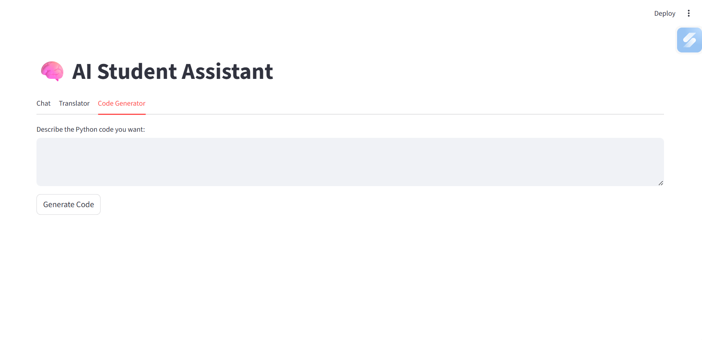

# AI Student Assistant

A Streamlit-based AI app that helps students with **chatting, translation, and Python code generation**. Perfect for learning, homework assistance, and coding help.

---

## Features

- **AI Chat:** Ask questions and get detailed answers.  
- **Translator:** Translate text between multiple languages (English, Hindi, Tamil, French).  
- **Python Code Generator:** Describe Python code you want, and get clean, ready-to-use Python code.

---

## Demo


Here are screenshots of the AI Student Assistant:

  
*AI Chat feature*

  
*Translator feature*

  
*Python Code Generator feature*

## Installation

1. **Clone the repository:**
```bash
git clone https://github.com/yourusername/AI_assistant_Notebook.git
cd AI_assistant_Notebook